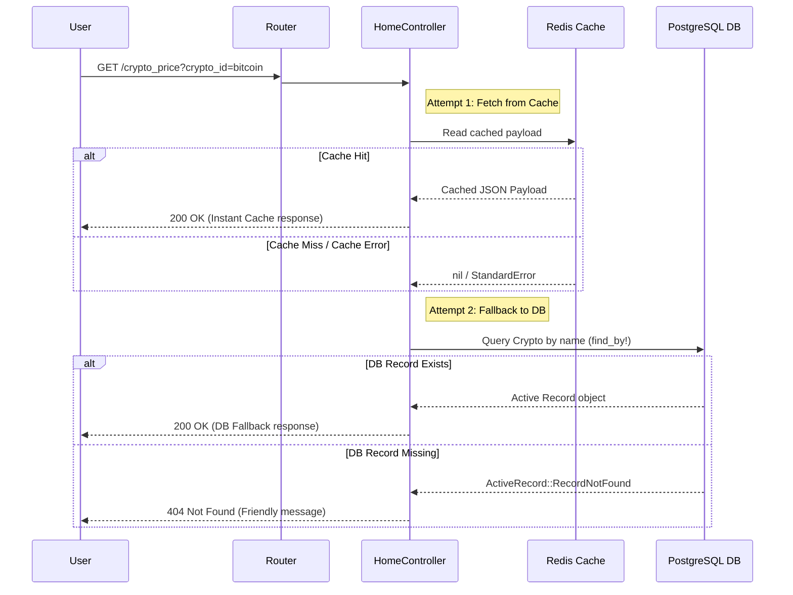

# CoinGecko Crypto Price Sync Service

A robust, high-performance Ruby on Rails API designed to synchronize, cache, and serve cryptocurrency prices from the CoinGecko API. 

The application utilizes a multi-tier fallback architecture (**Redis Cache** ➔ **PostgreSQL Database** ➔ **Robust Background Sync**) to guarantee high availability and consistent delivery of the last known price, even in the event of third-party API downtime or network latency.

---

## 🚀 Key Features

* **Multi-Tier Availability**: Reads are served instantly from a low-latency Redis cache. If the cache is empty/fails, it seamlessly falls back to PostgreSQL.
* **Resilient Background Syncing**: A recurring scheduler enqueues a Sidekiq background worker every **1 minute** to fetch the latest prices from CoinGecko, ensuring data freshness without blocking web request-response loops.
* **External API Resilience**: Implements strict connection error and payload validation handling. If CoinGecko fails, the system continues serving the last stored database price seamlessly.
* **Full Test Coverage**: Robust suite of RSpec unit, request, and job specs verifying the caching layers, fallback strategies, and sync job states.

---

## 🛠 Tech Stack & Services

* **Ruby on Rails** (v7.2+)
* **PostgreSQL** (Relational Database for persistent last-known price storage)
* **Redis** (Unified backend for Sidekiq queues and ActiveSupport cache store)
* **Sidekiq** (Concurrent background job processor)
* **Whenever** (Cron-scheduling utility generating clean crontab entries)
* **Faraday** (Robust HTTP/REST client for external requests)

---

## 🏗 System Architecture & Flow



---

## ⚙️ Core Components

### 1. Scheduler (`config/schedule.rb`)
Uses the `whenever` gem to schedule the Rails rake task to run **every minute**.
```ruby
every 1.minute do
  rake "crypto_prices:refresh"
end
```

### 2. Rake Task (`lib/tasks/crypto_prices.rake`)
An environmental bridge that enqueues the Sidekiq background job asynchronously:
```ruby
namespace :crypto_prices do
  task refresh: :environment do
    CryptoPriceRefreshJob.perform_later
  end
end
```

### 3. Background Sync Job (`app/jobs/crypto_price_refresh_job.rb`)
* Iterates through supported coins in `Crypto::COINS` (Bitcoin, Ethereum, Solana, XRP, Cardano, Dogecoin).
* Queries the CoinGecko API over Faraday.
* Persists the fresh prices into PostgreSQL.
* Writes the structured payload into the Redis cache with a 5-minute expiration period.

---

## 🏁 Setup & Installation

### Prerequisites
Make sure you have the following installed:
* Ruby (v3.3+)
* PostgreSQL
* Redis

### 1. Install Dependencies
```bash
bundle install
```

### 2. Configure Credentials
Store your CoinGecko API key in Rails credentials:
```bash
EDITOR=nano bundle exec rails credentials:edit
```
Add the key in the following format:
```yaml
API_KEY: "your_api_key"
```

### 3. Setup Database
```bash
bundle exec rails db:create db:migrate
```

### 4. Apply Cron Schedule (Whenever)
Write the configured cron schedules to your system's crontab:
```bash
bundle exec whenever --update-crontab
```

---

## 🏃 Running the Application

### 1. Start Redis Server
Ensure your Redis instance is running locally:
```bash
redis-server
```

### 2. Start Sidekiq
Launch Sidekiq to begin processing background refresh tasks:
```bash
bundle exec sidekiq
```

### 3. Start Rails Server
Run the local development server:
```bash
bundle exec rails server
```

Now, query the API in your browser or client:
```bash
curl -H "Accept: application/json" "http://localhost:3000/crypto_price?crypto_id=bitcoin"
```

---

## 🧪 Testing

The application features a comprehensive RSpec test suite covering model logic, controller response states, database fallback workflows, and edge-case job conditions (such as API failures or Redis caching downtime).

Run the tests using the following command:
```bash
bundle exec rspec 
```

---

## 🐳 Dockerization & Container Orchestration

The application is fully containerized using **Docker** and **Docker Compose**, orchestrating the Rails web app, Sidekiq worker, Redis cache, PostgreSQL database, and recurring scheduler out of the box with production configurations.

### Services Orchestrated
1. **`db`** (`postgres:16-alpine`): Persistent storage volume mapping.
2. **`redis`** (`redis:7-alpine`): Caching and Sidekiq queuing backend.
3. **`web`** (Rails API): Port `3000` entry point with DB migration checking on boot.
4. **`sidekiq`** (Sidekiq worker): Asynchronous price fetch tasks runner.
5. **`scheduler`** (Bash sync-loop): Triggers `rake crypto_prices:refresh` every 60 seconds.

### Quick Start with Docker Compose

A `.env` file containing your `RAILS_MASTER_KEY` has been generated for you in the project root. Docker Compose automatically picks this up, so there is no need to manually export keys or manage environment variables!

#### 1. Build and Start the Containers
Simply run the start command directly:
```bash
docker compose up --build
```

Docker Compose will automatically:
- Load the master key securely from `.env`.
- Wait for PostgreSQL and Redis to be fully healthy.
- Run `db:prepare` on database startup (creating the database and running migrations).
- Launch the web server on `http://localhost:3000`.
- Start Sidekiq and the active scheduler daemon.

#### 2. Test the Running API
Query the containerized API via cURL:
```bash
curl -H "Accept: application/json" "http://localhost:3000/crypto_price?crypto_id=ethereum"
```

#### 3. Stop Services
To clean up and stop all container services:
```bash
docker compose down
```
```
